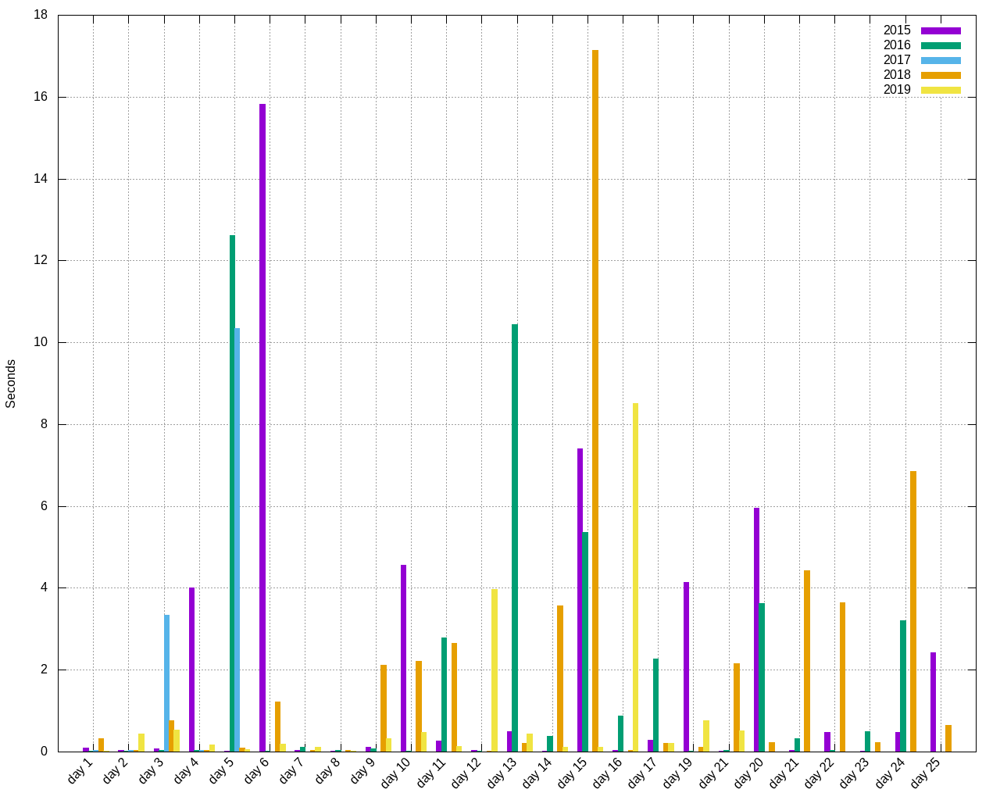

# Advent of code

These are my solutions to the AdventOfCode puzzles (https://adventofcode.com).

## Building

If you want to build/run these puzzles, take a look in the
[.travis.yml](.travis.yml) file.

## Erlang puzzle runtimes

